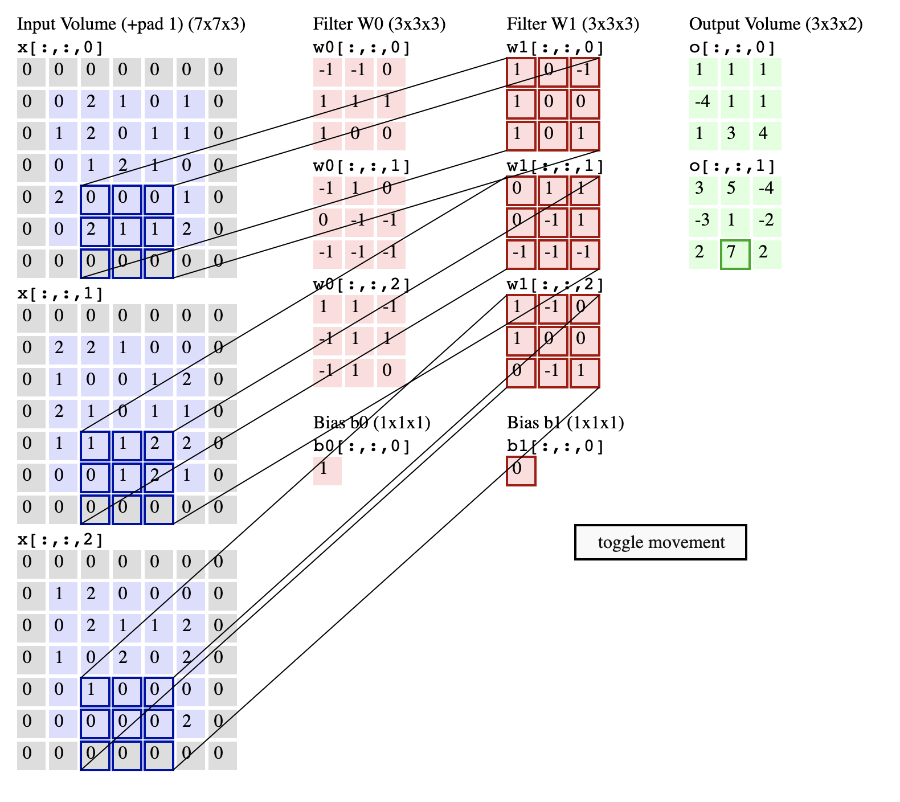
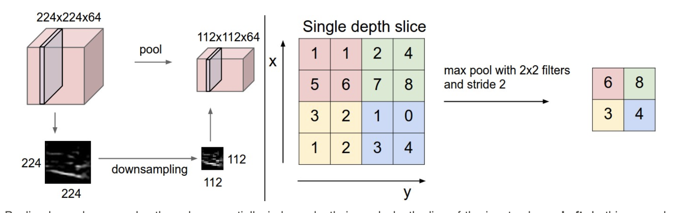

Convolutional Neural Networks
---

Now that you have the fundamentals of neural networks down, it is time to move on to more
practical applications.
Convolutional networks are a bit more complex then regular
dense networks (the only kinds you have worked with so far) and they handle a different
variety of problems.

Convolution is a process that gives the nodes in our networks the ability to determine
context.
The activation of one node in a network is dependent on the activations
of the nodes around it, which makes this a particularly useful tool for image problems.

That will be the focus of this lesson: neural networks for image processing.
There is significant crossover between this lesson and the application of neural networks to signal processing problems.

We will be using the CIFAR10 dataset, which has thousands of images broken into 10 classes.
This means that every image in the dataset can be binned into one of 10 categories.

Layers
---

The new layers we will be working with in our convolutional network are convolutional layers and pooling layers.

Conv Layers
---

These layers are much like what you've been exposed to in Physics with Laplace transforms.
Please see the figure below for a diagram of how the convolutions are applied:

A convolutional layer is made up of filters, each of which is applied to the input matrix as seen above.
The diagram above is animated at [this link](https://cs231n.github.io/convolutional-networks/).
Please visit that site and watch the algorithm in action, hopefully developing some intuition for the operation.

Pooling Layers
---

Typically after a convolutional layer, a *pooling* layer is applied.
This reduces the size of a matrix by pooling elements together, as seen in the diagram below:

Pooling is a form a downsampling to reduce the size of the data that the network
must keep in memory.
This does not change the performance of the network much, so it's very useful in increasing the performance of our network.
