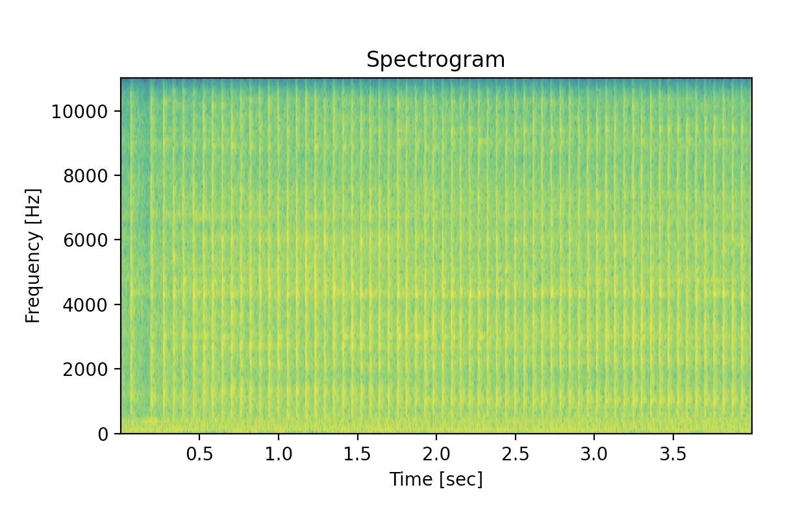

Now Let's Process Some Damn Signals
---

Please download the dataset for this project from [this link](https://urbansounddataset.weebly.com/download-urbansound8k.html).
Please also do a small amount of research on the urbansound8k dataset so you are familiar with the problem domain for this lesson.

In this project, we will be classifying sound waves with a variety of methods.
We will be combining many of the skills we've aquired in this lesson, adding very little on top.
Combining all of the tools you've aquired thus far will prove to be the greatest challange in this lesson I think.

Feature Engineering
---

One of the most important skills of a data scientist (or anyone employing machine learning techniques) is feature engineering.
This involves deciding which features are relevant, and therefor which features the model should concern itself with.
In other words, ***feature engineering constrains the domain over which we intend to model***.
If we can simplify the problem domain, we can simplify the model, reduce the required resources, and increase the probability that our model will fit the data well.
Sometimes, the features of very complex dataset (which would normally require a very deep neural network on powerful hardware to fit) can be engineered to the extent that a much smaller and less computationally expensive model may be better suited.
For example, let us look at a single audio sample (found in UrbanSound8K/audio/fold5/104998-7-7-0.wav):


This appears to be quite noisy.
How might we structure a model to handle these data?
Perhaps we could take advantage of how cyclic the data are.

If we want our network to pick up on the cyclic nature of our data, we may have to engineer it quite a bit.
To *reduce the problem domain*, let us reduce our featureset from raw wave data to the frequencies it is composed of by using the discrete Fourier Transform:


This seems to have reduced the domain of the problem quite a bit.
Let us further constrain the problem domain by only concerning ourselves with the peaks of the FFT:


Think about this from the model's perspective:
we were previously asking our model to classify about 44,000 data points, and now we have restricted the problem domain for one sample to the top 15 or so peaks of the FFT:

```python
inputs = [
  0.00120109,
  0.00122934,
  0.00127762,
  0.00129138,
  0.00131142,
  0.00132062,
  0.00134172,
  0.0013877,
  0.00139636,
  0.00168055,
  0.00171808,
  0.00185077,
  0.0024096,
  0.00290597,
]
```

To move forward with this model may mean that we no longer need a neural network for this dataset.
Perhaps a simple decision tree or k-means classifier would be able to classify the top 15 peaks of the FFT of the raw audio, whereas it may take a convolutional neural network days to train on high-end hardware if the network could only operate on the raw data.
Hopefully you now see the power and importance of feature engineering.
This skill could save your organization thousands of dollars on compute resources!

If we do have the resources however, we may engineer our data further.
This is why we will not use the peaks of the FFT as our data input for this model, but keep the principle of reducing the problem domain as much as possible in mind.
By using the FFT, we lost the time domain to gain valuable information in the frequency domain.
If we have the resources to train a large convolutional network, we could extend our data to contain time, frequency, and magnitude in our dataset.
This way, we are only looking at the most valuable information contained in the data, and extending the 2d audio data into 3d makes our data feel more like an image problem.



Looking at the spectrogram of our data, we can see that the most intense audio waves occur at very low frequencies and only at the beginning of the audio sample.
It seems that we have all of the information we need to train a very robust network!

Let us now look at the full picture:


A convolutional network trained on the spectrogram data as would learn to recognize patterns in the the time, frequency, and intensity dimensions, which is exactly what we want for audio data that is time, intensity, and frequency dependent.
We are now ready to train a network on these data.

Assuming you've already downloaded the dataset for this lesson, please proceed to `viz.py` to take a look at the dataset.
